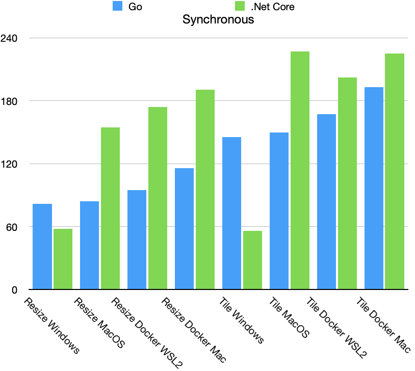
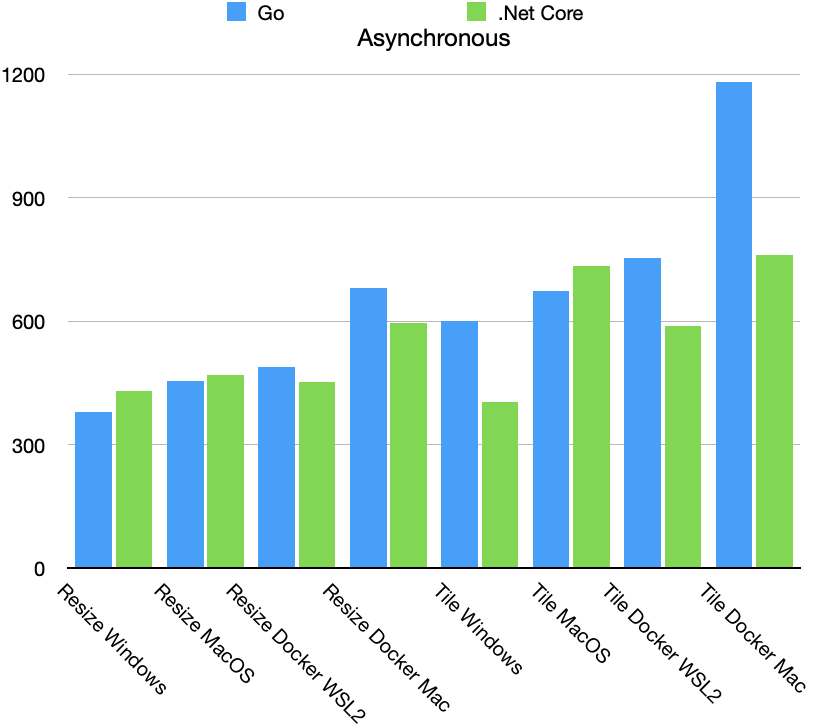

In a [previous post](https://mkehoe.github.io/posts/benchmarking-net-core-platforms-image-processing/), I performed a bunch of benchmarking on .Net Core for different platforms. Since Go is all the rage these days and I haven't had the pleasure of testing it out yet, I decided to extend this benchmarking to an Api built with Go 1.14. 

#### Benchmarks

The test setup is exactly the same, a Macbook Pro dual booting Windows and MacOS with both OS's running docker. For this benchmark, the Go Api is designed to match the .Net Core Api, so the same [.Net Core application](https://github.com/mkehoe/benchmark-imageprocessing) will be used to conduct the benchmark. Here are the results.

###### Resize Synchronous

| Platform    | T1   | T2    | T3   | T4     | T5    | Total  |
| ----------- | ---- | ----- | ---- | ------ | ----- | ------ |
| Windows     | 0    | 32.19 | 0    | 30.21  | 17.55 | 81.68  |
| Docker WSL2 | 0    | 35.94 | 0    | 34.4   | 20.44 | 94.88  |
| Docker Mac  | 0    | 36.44 | 0    | 45.14  | 24.04 | 115.64 |
| MacOS       | 0    | 33.39 | 0    | 31.76  | 17.84 | 84.17  |

###### Tile Synchronous

| Platform    | T1   | T2    | T3   | T4     | T5    | Total  |
| ----------- | ---- | ----- | ---- | ------ | ----- | ------ |
| Windows     | 0    | 31.52 | 1.16 | 39.1   | 71.94 | 145.37 |
| Docker WSL2 | 0    | 35.04 | 0.98 | 44.56  | 82.41 | 167.19 |
| Docker Mac  | 0    | 35.14 | 1.04 | 53.13  | 94.25 | 193.27 |
| MacOS       | 0    | 31.36 | 1.33 | 41.35  | 74.76 | 149.77 |

Since the internal Api calls are different, the time intervals don't exactly match the ones from .Net Core. The Go time intervals all in ms:

* _T1 - GetFile from HTTP Request_
* _T2 - Decode Jpg File_
* _T3 - Create New Bitmap(noop for resizer)_
* _T4 - Draw Image_
* _T5 - Save to Jpeg_

And the asyncronous results:

###### Resize Asynchronous

| Platform    | T1    | T2      | T3   | T4       | T5      | Total    |
| ----------- | ----- | ------- | ---- | -------- | ------- | -------- |
| Windows     | 0     | 95.9083 | 0    | 238.0517 | 34.4816 | 378.883  |
| Docker WSL2 | 0     | 116.425 | 0    | 290.291  | 56.244  | 489.425  |
| Docker Mac  | 0     | 138.25  | 0    | 330.675  | 95.005  | 681.525  |
| MacOS       | 0     | 113.35  | 0    | 279.375  | 51.241  | 455.9083 |

###### Tile Asynchronous

| Platform    | T1    | T2        | T3      | T4        | T5        | Total     |
| ----------- | ----- | --------- | ------- | --------- | --------- | --------- |
| Windows     | 0     | 99.95     | 3.366   | 321.72567 | 164.78833 | 600.3583  |
| Docker WSL2 | 0     | 117.39167 | 2.35833 | 365.5083  | 245.2833  | 752.625   |
| Docker Mac  | 0     | 128.883   | 21.992  | 421.71667 | 471.73333 | 1181.825  |
| MacOS       | 0     | 117.467   | 6.516   | 345.217   | 193.875   | 673.44167 |

#### .Net Core Comparison

#### Conclusions

One noticeable difference in implementing the tiling for Go was the required resize before the drawing the image into the new image. In .Net Core with GDI+ this was handled under the hood in a single operation and it appears to be much faster. 
 
In comparing the 4 platforms for Go, the synchronous benchmark the Windows implementation is slightly better than the MacOS one and both are better than the docker implementations. This very pronounced in the async testing.

So far Windows seems to be the fastest platform for both .Net Core and Go, but its doubtful I would ever use it as a production platform for either. Interestingly enough, Go seems to be much faster in the synchronous test case for both Docker platforms, but when the Api is under load the results are completely reversed. Docker is a convenient and popular method for production deployments these days, and it appears Microsoft's recent work to optimize for this scenario has paid off.  

Github links: [Web API](https://github.com/mkehoe/go-imageprocessing)