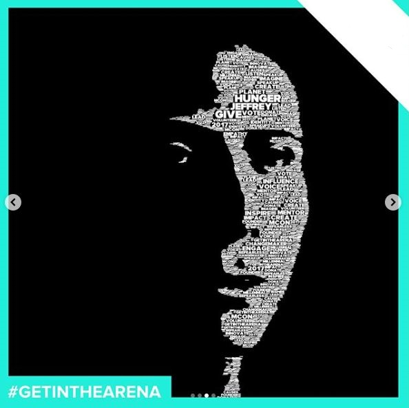
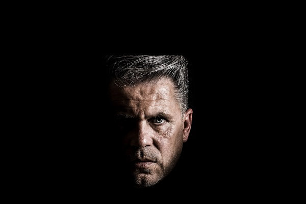
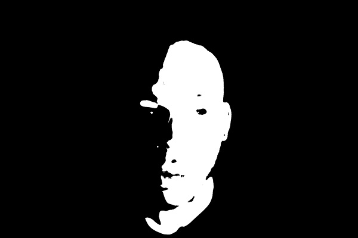
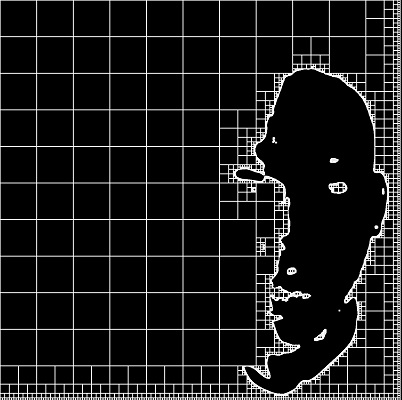
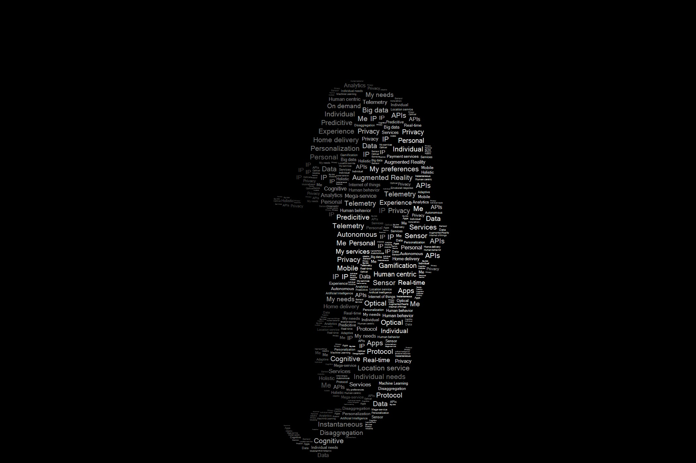

In another life when I worked for a photobooth company, I was doing a lot of "creative coding" and one of the more interesting projects I worked on back then involved manipulating words into a portrait of an individual. This is probably the only project I ever agreed to that I had no idea how I was going to complete it. The algorithm wasn't perfect artistically, but it was good enough that we ended up using this for a few marketing campaigns so I thought I would detail it here.

#### Low Key Photography

This project was done over a couple of weeks so time was limited and we had to limit some of the real world variables. We used a light source behind the camera and offset to one side of the face. This creates a standard photography effect called low key which is good for highlighting a section of the face.

#### Image Filtering

In order to figure out areas where we should place the text, we need to create a mask showing us only the skin. This doesn't need to be perfect and will be blurred, so the quick and dirty way is to convert to HSV and do a range lookup of skin colors.

#### Quadtree Generation.

When I started this project, I wasn't sure how I was going to spatially separate areas and then do lookups, but after researching options in computer graphics quadtree's seemed like it should do the trick. I won't get into to much detail about it here because there is a lot of info out there about them, but from a high level it allows you to segment irregular areas into different sized boxes. Spatial lookups will be done later on, so for now the areas not available get added into the quadtree. After this stage visually, the quadtree looks like this:

#### Add Text

Until now the processing has been really fast, but for this part I couldn't come up with a quicker way of filling in the text other than iterating all the pixels. The algorithm walks all the pixels and checks if the current pixel is already in the quadtree. If it isn't a max size is calculated, and then a word is drawn from a dictionary with matching sizing guidelines. The area that the word fills is inserted into the quadtree and the rest of the image is iterated.

The original design called for have the larger text in center, with smaller text being near the edges. This effect tends to happen since we are walking the image left to right and the edges of the face tend to have some texture, though your mileage will vary. The final output from above is one of the better examples, and here is another example that didn't wasn't quite as good.

For some of the campaigns, we used a design where all the text was the same size. For these campaigns to enhance the design we overlayed an image onto the text areas. This was accomplished by doing a final passthrough and setting all non-black pixels to a subsampled RGB value from an image. 

I do still have an preliminary version of the code laying around and may clean it up and post it at some point.

